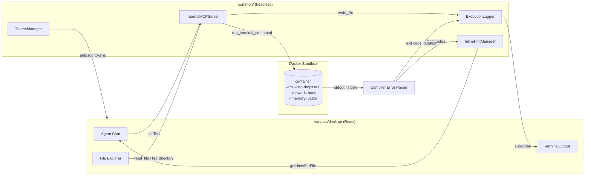

# NexusAgent Studio — Architecture

> Technical reference for the multiplatform code editor core.

## 1. Repository layout

```
common/            Headless, UI-agnostic core (no DOM, no React)
  debug/           Event-sourced ExecutionLogger + inline hints
  docker/          Docker sandbox runner + compiler error parser
  mcp/             InternalMCPServer + MCP tools
  plugins/         Plugin contracts + PluginManager
  security/        Path traversal guard
  themes/          Reactive ThemeManager
variants/          UI/platform targets built on top of common/
  desktop/         React 19 + Tailwind v4 desktop shell
plugins/           First-party plugins (.plg.ts) using the plugin contract
layout/            Static HTML design references (not part of the build)
docs/              This documentation
```

## 2. `common/` — the headless core

`common/` is the single source of truth for behaviour. It has **no DOM and no UI
dependency**: it runs identically in an Electron/Tauri main process, a Node
worker, a test runner, or (partially) a browser/WASM target.

Public surface is re-exported from `common/index.ts`:

| Module | Responsibility |
| --- | --- |
| `common/mcp/server.ts` | `InternalMCPServer`, a lifecycle wrapper over the MCP v2 `McpServer` factory |
| `common/mcp/tools/*` | Built-in tools: file I/O, editor context, Docker terminal |
| `common/debug/logger.ts` | Immutable, append-only `ExecutionLogger` (event sourcing) |
| `common/docker/*` | Container isolation, resource limits, stream separation, error parsing |
| `common/plugins/*` | `PluginManifest` / `PluginContext` / `PluginLifecycle` + `PluginManager` |
| `common/themes/*` | Pub/Sub theme token store for UI + syntax highlighting |
| `common/security/*` | Workspace-confined path resolution |

### 2.1 Why a factory-based MCP server

MCP v2's `serveStdio(factory)` calls a **factory** once per connection to build
the server instance that serves that connection. `InternalMCPServer` therefore
does not own a long-lived `McpServer`; it owns the *registrations* and builds a
fresh instance on demand:

```
InternalMCPServer (holds tool registrations)
        │  build()
        ▼
   new McpServer(...)  ──►  serveStdio(() => server)  ──►  StdioServerHandle
```

This is what makes dynamic plugin tool injection possible: a plugin can
`registerDynamicTool(...)` at any time, and the next `build()` picks it up.

## 3. Compilation strategy for `variants/`

`variants/` targets are thin. They depend on `common/` but never the reverse.

| Target | Runtime | Build | Notes |
| --- | --- | --- | --- |
| `desktop` | Electron / Tauri shell + Chromium | Vite | React 19, Tailwind v4 CSS-first `@theme` |
| `web` (planned) | Browser / WASM | Vite + wasm-pack | `common/` must stay DOM-free to allow `wasm32` compilation |
| CLI (planned) | Node.js | esbuild | Direct `common/` import |

The Node core is bundled with esbuild (`npm run build`), keeping `node_modules`
external (`--packages=external`) so native/alpha dependencies resolve at
runtime. The desktop variant is bundled with Vite.

## 4. Communication flow



1. The UI (or an agent) invokes a tool through `InternalMCPServer`.
2. File mutations are recorded as immutable `LogEntry` objects by the
   `ExecutionLogger` (`author: 'AI' | 'USER' | 'SYSTEM'`).
3. `run_terminal_command` hands the command to the Docker sandbox, which
   enforces isolation flags, captures **stdout and stderr separately**, and
   returns exit code + wall-clock duration.
4. Compiler output from `stderr` is parsed; each diagnostic is attached as an
   `InlineHint` at the exact file/line, and the container run is recorded in the
   logger.
5. UI subscribers re-render from the event stream — nothing polls.

## 5. Security model

- **Path confinement** — every file tool resolves through
  `resolveWorkspacePath()`, which rejects absolute paths outside the workspace
  root and any `..` escape (also after `symlink`-free normalization).
- **Atomic writes** — `write_file` writes to a temp file in the same directory
  and `rename()`s it, so a crash never leaves a half-written file.
- **Container isolation** — `--rm --cap-drop=ALL --security-opt=no-new-privileges
  --memory=512m --cpus=1.0`, optional `--network=none`, workspace mounted at
  `/workspace` with `-w /workspace`.
- **Least privilege** — the sandbox container never receives the Docker socket,
  the host home directory, or SSH agent forwarding.
- **AF_ALG / seccomp** — Docker's default seccomp profile blocks `AF_ALG`
  sockets, which neutralises the class of page-cache write issues seen in
  CVE-2026-31431 (`algif_aead`). We keep the default profile and additionally
  drop all capabilities. The fix for that CVE is a **kernel** patch; Docker
  version pinning is for reproducibility, not for the mitigation.

## 6. Dependency policy

See the **Stack Declaration** in `README.md`. Every external API used in this
repository was verified against its official documentation before use. The
current verified set is:

- `@modelcontextprotocol/server` / `client` / `core` — **v2** (spec 2026-07-28)
- `zod` v4 via the `zod/v4` subpath
- `typescript` 7.x toolchain
- `react` 19.x (there is no React 20)
- `tailwindcss` 4.x CSS-first `@theme` (there is no Tailwind 5)

## 7. Testing

`vitest` runs against `common/**` and `plugins/**` in Node. The Docker sandbox
takes an injectable command executor (`CommandExecutor`) so tests can assert the
exact `docker run` argv without a daemon — which is also why the unit tests could
not notice that the argv was missing the `docker` binary itself (see
`docs/PROJECT_STATE.md` §3, item 25).
